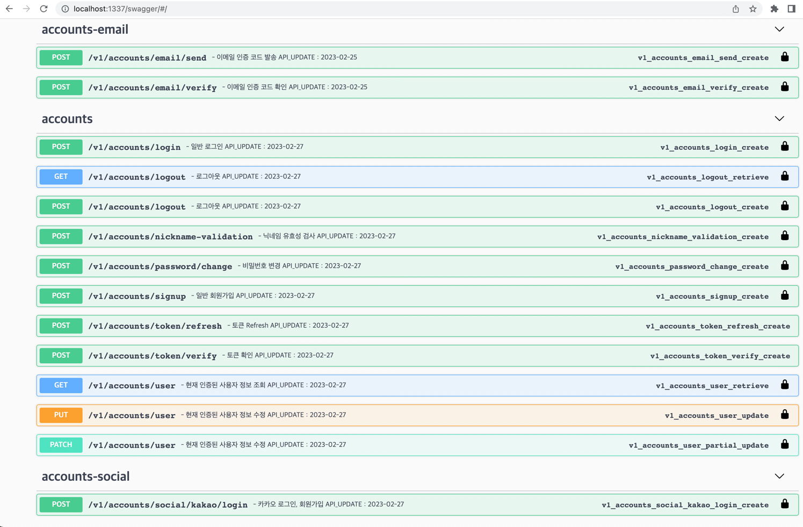

# 이 레포지토리에서 개발자 심완우의 Django, DRF 작업 스타일을 확인 하실 수 있습니다!
##### !*이 레포지토리는 언제든 비공개로 전환 될 수 있습니다!
많은 기능을 넣어 정리되지 못한 코드가 있는것 보단 
짧은 기간 작업하여 저의 스타일을 잘 나타내고 보기 좋은 깔끔한 코드만 공개 될 수 있도록 
작업 하였습니다

dj-rest-auth를 사용한 회원가입, 로그인 api\
celery + rabbitMQ를 사용한 비동기 email발송 api\
기본 적인 게시판 api\
댓글, 대댓글 api 

어렵지않은 기능이므로 코드 퀄리티를 높이기 위해 노력했습니다\
models, url, serializers, views, test 둘러봐 주시면 감사하겠습니

문서화를 위한 Django swagger drf-spectacular를 사용하였습니다\
ex docs img)

Docker를 사용하여 빌드하였습니다

